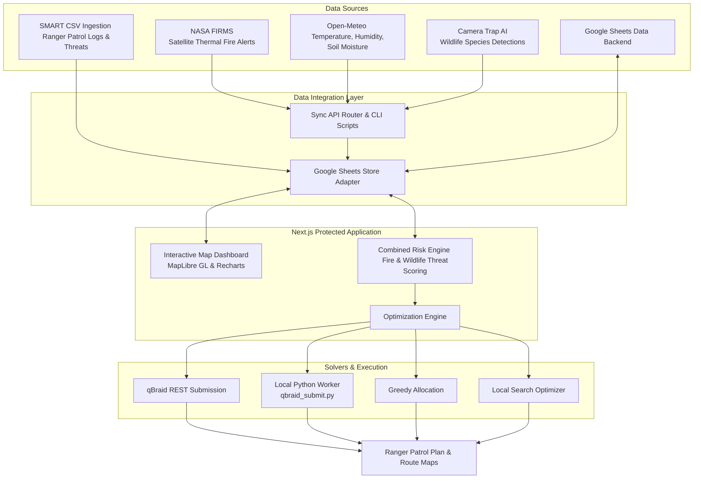

# 🌲 RangerQ - Khao Yai National Park Digital Twin & Patrol Optimizer

RangerQ is a cutting-edge Digital Twin and Spatiotemporal Patrol Planning platform designed for **Khao Yai National Park, Thailand**. By combining multi-source real-time environmental data with advanced optimization models, RangerQ assists park rangers in fire prevention, wildlife protection, and resource allocation.

The platform offers classical optimization algorithms (Greedy Selection, Local Search) alongside a state-of-the-art **Quantum/Hybrid Solver (QUBO)** run on the **qBraid Platform** (simulators or real quantum annealers) to select optimal patrol zones and generate detailed route directions.

---

## 🏗️ Architecture & Data Flow



---

## ✨ Features

- **🗺️ Interactive 3D Digital Twin Map**: Powered by `maplibre-gl`, visualizing boundaries, trails, evergreen forest blocks, water sources, and ranger stations with live heatmaps of fire hotspots and wildlife sightings.
- **🛰️ Satellite-Driven Fire Monitoring**: Direct sync with the NASA FIRMS (Fire Information for Resource Management System) to plot near-real-time satellite thermal anomalies.
- **🌤️ Hyper-Local Weather Integration**: Integration with the Open-Meteo API to record relative humidity, wind vectors, and surface-to-deep soil moisture levels per zone.
- **📷 Camera Trap AI & Ranger Observation Ingestion**: Upload and process structured data representing wildlife distributions, patrol team observations, and threat categories.
- **⚡ Spatiotemporal Risk Scoring**: A multi-criteria evaluation engine that computes zone-level fire and wildlife protection priorities based on real-time factors (e.g., proximity to water, soil dryness, wind gusts).
- **⚛️ Quantum QUBO Optimization**: Formulation of the zone selection problem into a **Quadratic Unconstrained Binary Optimization (QUBO)** model, solvable using classical heuristics or quantum solvers on the **qBraid** network.
- **📒 Google Sheets Database Backend**: Complete storage flexibility, enabling transactional API operations backed entirely by a Google Sheets spreadsheet via Google Apps Script macros.

---

## ⚙️ Environment Variables Setup

Create a `.env.local` file in the root directory (based on `.env.example`):

```bash
# Data Storage Options (default: google_sheets)
DATA_BACKEND="google_sheets"

# Google Sheets Connector
GOOGLE_SHEETS_API_URL="https://script.google.com/macros/s/.../exec"
GOOGLE_SHEETS_API_TOKEN="your-secure-token"
GOOGLE_APPS_SCRIPT_EDITOR_URL="https://script.google.com/d/.../edit"

# Encryption & Session Auth
AUTH_SECRET="your-32-byte-base64-secret"
APP_BASE_URL="http://localhost:3000"

# Demo Credentials
DEMO_ADMIN_EMAIL="admin@example.com"
DEMO_ADMIN_PASSWORD="secure-password"

# NASA FIRMS API (For syncing thermal fire data)
FIRMS_MAP_KEY="your-nasa-firms-api-key"

# qBraid Quantum API
QBRAID_API_URL="https://api.qbraid.com/..." # Leave blank to default to Local CLI worker
QBRAID_API_KEY="your-qbraid-api-key"
QBRAID_DEVICE_ID="qbraid_qir_simulator" # Or target hardware like dwave_advantage

# Map Styling
MAP_STYLE_URL="https://demotiles.maplibre.org/style.json"
```

---

## 🚀 Getting Started

### 1. Install Dependencies
This project uses `pnpm` as its primary package manager:
```bash
pnpm install
```

### 2. Generate and Sync the Database
If you are starting fresh with the Google Sheets backend:
1. Create a local template of the spreadsheet workbook:
   ```bash
   pnpm sheets:workbook
   ```
2. Upload this spreadsheet to Google Sheets, set up your Google Apps Script using the script provided in `scripts/google-apps-script/Code.gs`, and copy the Deployment Web App URL to `GOOGLE_SHEETS_API_URL`.
3. Seed the initial zone boundaries, user profiles, and config:
   ```bash
   pnpm sheets:seed
   ```

### 3. Spin Up the Dev Server
```bash
pnpm dev
```
Open [http://localhost:3000](http://localhost:3000) to view the portal.

---

## 🛠️ Maintenance & Ingestion Scripts

RangerQ relies on background sync processes to retrieve live external events:

- **Sync Satellite Hotspots**: Syncs NASA FIRMS active fire hotspots in Khao Yai bounds:
  ```bash
  pnpm sync:firms
  ```
- **Sync Zone Weather**: Retrieves current meteorological metrics and soil details:
  ```bash
  pnpm sync:weather
  ```

---

## ⚛️ Run Python qBraid Worker Offline

If you do not use the remote qBraid REST API, the optimizer writes the payload to `.rangerq/latest_qubo.json` and transitions to a `QBRAID_PENDING_EXTERNAL_WORKER` state. You can submit the job locally using the Python helper:

1. **Install python packages**:
   ```bash
   pip install qbraid qiskit numpy scipy requests
   ```
2. **Submit / Dry-Run Job**:
   ```bash
   python scripts/qbraid/qbraid_submit.py --input .rangerq/latest_qubo.json --output .rangerq/latest_qbraid_result.json --dry-run
   ```

---

## 🧪 Testing

RangerQ includes Playwright End-to-End tests to validate risk calculations, imports, and optimization runs:

- Run tests headlessly:
  ```bash
  pnpm e2e
  ```
- Open Playwright UI dashboard:
  ```bash
  pnpm e2e:ui
  ```

---

## 🌟 Context & Acknowledgements

This project was developed in just **2 days** during the **SEA Quantum Leadership Summit 2026** with supported API tokens kindly provided by **qBraid**. 

*Note: The developer wasn't an actual hackathon participant, but rather attended as a speaker and media representative. However, seeing everyone else coding and building amazing things was so inspiring that it made them want to jump in and code this!* 💻✨
